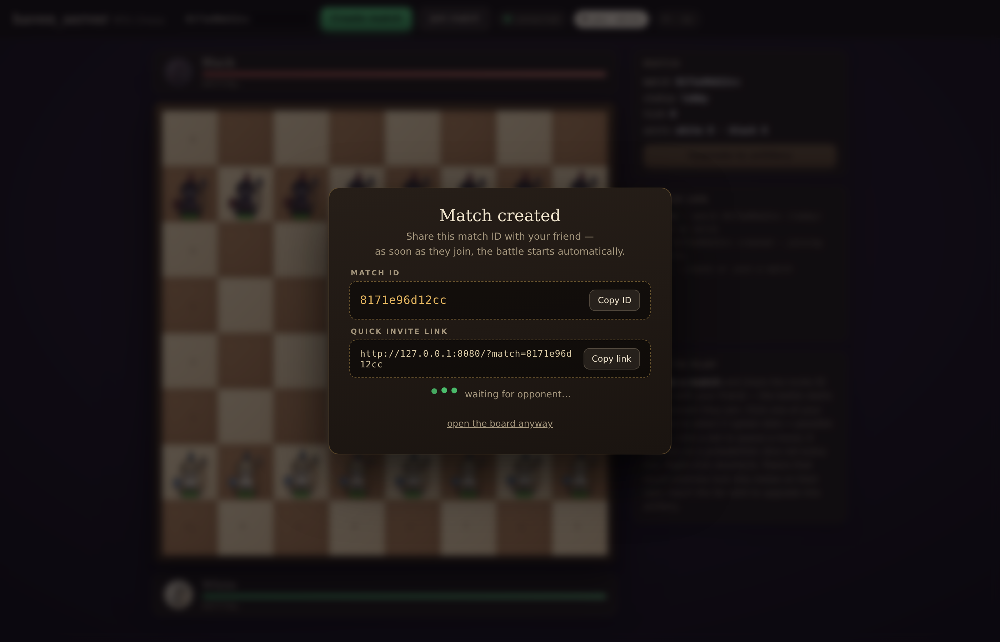
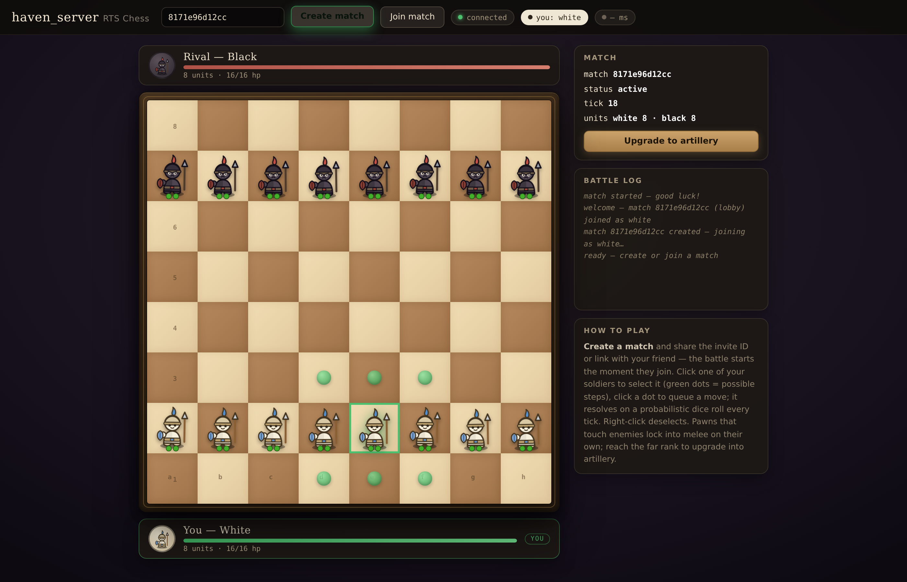
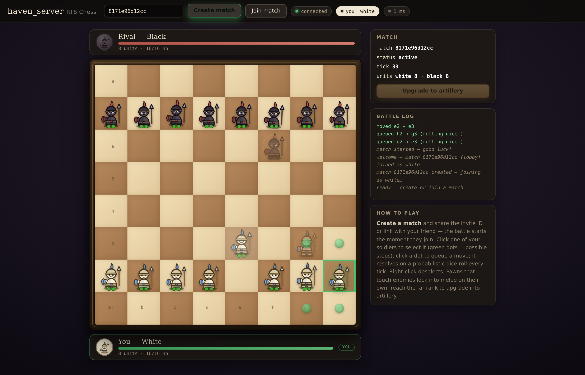
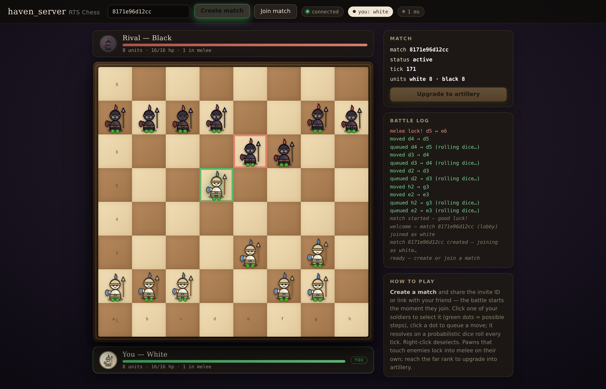
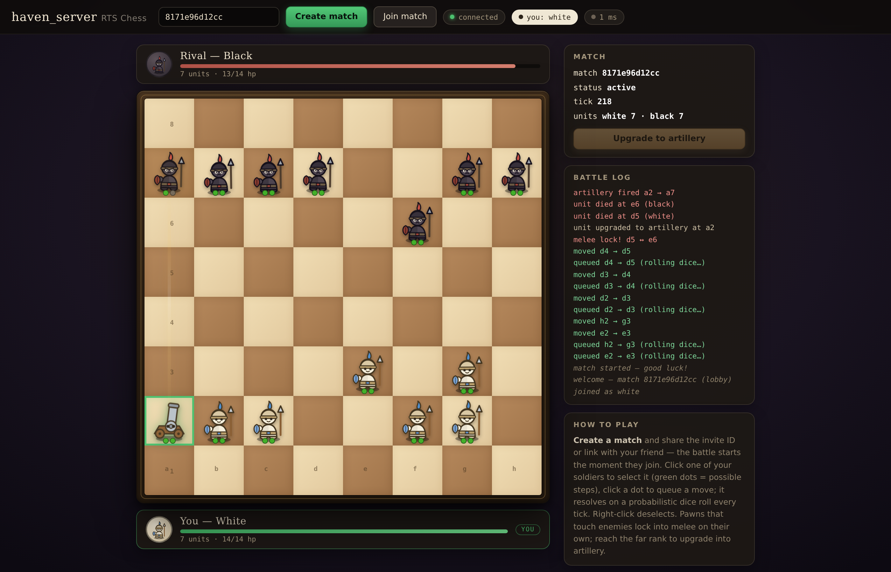
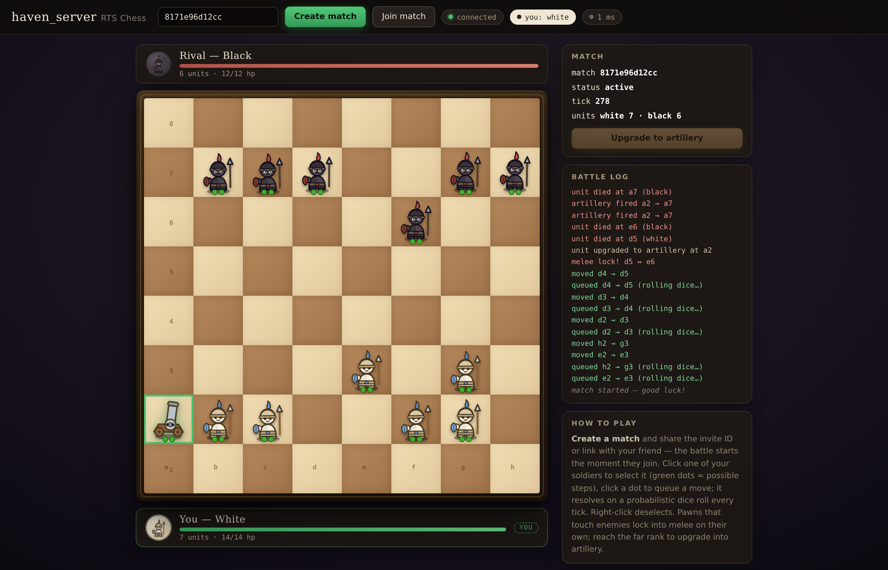
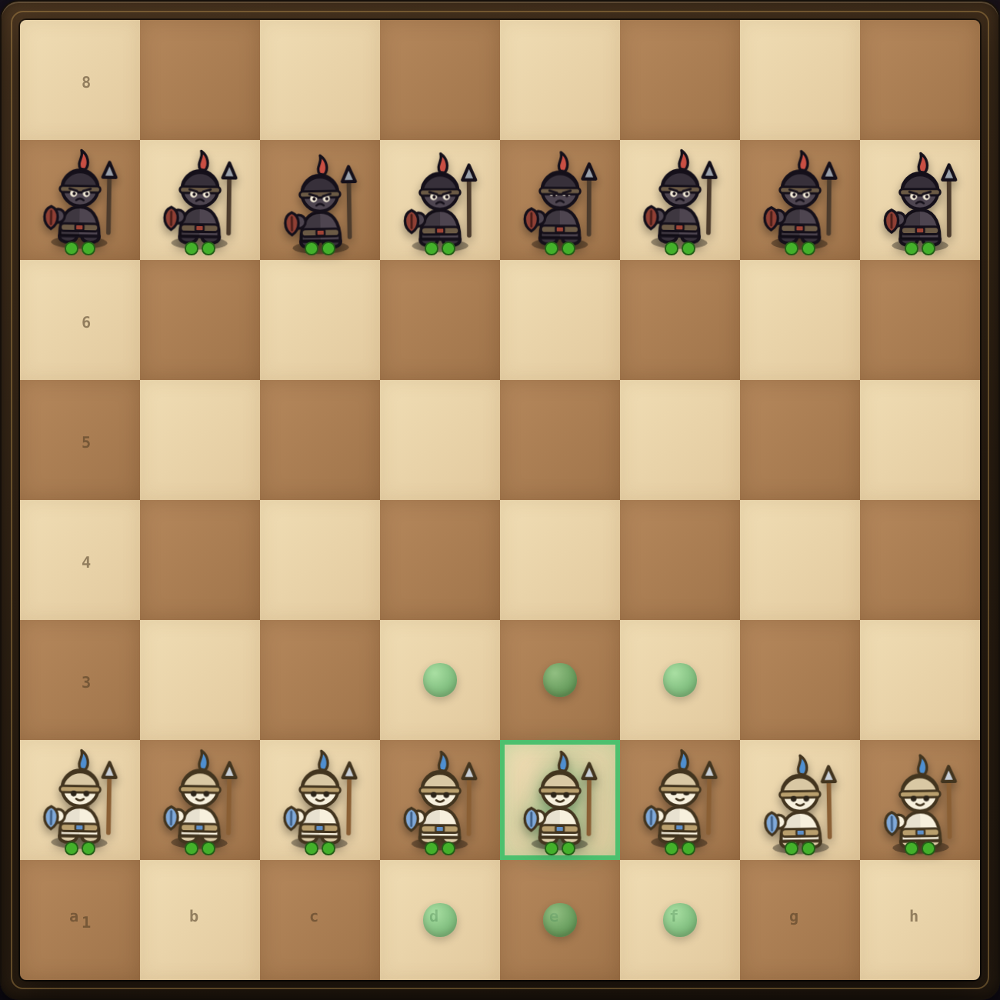

# haven_server

Authoritative **RTS Chess** game server: chess meets real-time strategy.
Built with **Rust + Axum + Tokio + WebSocket**. The server is the single source
of truth — clients send inputs, the server simulates and broadcasts state.

## Screenshots

Captured from the embedded web client during a real match (the demo is driven
headlessly by `scripts/take_screenshots.py` in the dev workspace).

**Create a match — blocking invite popup with the match ID, one-click copy and
a share link; it closes itself the moment your friend joins**


**Select a soldier — green ring, pulsing move-target dots**


**Queued moves roll the dice every tick — ghost pieces with a dashed ring show
pending intent while the mover tenses up**


**Adjacent enemies lock in melee — red pulse, lunges and knockback, damage
ticks down on a cooldown**


**Pawn upgraded to artillery — one-eyed cannon character firing straight-line
shots with a tracer beam and line-of-sight checks**


**Mid-game overview — the board takes center stage, player plaques with live
army strength, colored battle log**


**The pieces are characters, not glyphs: helmeted soldiers with shield and
spear (white with blue plume, black with crimson plume)**


## Web client

The built-in browser client (two browser tabs = two players) ships with:

- **Invite flow** — creating a match opens a blocking popup with the match ID
  and a one-click `?match=…` invite link; the link auto-joins the friend and
  the popup closes itself when the battle starts.
- **Board-first layout** — the board is the hero: responsive tile sizing fills
  the viewport, player plaques above/below show live army strength and melee
  count, side panels stay secondary.
- **Character pieces** — hand-drawn SVG soldiers and cannon creatures instead
  of classic chess glyphs, with health pips.
- **Animations everywhere** — per-unit idle bobbing with random phase, eye
  blinks, scanning artillery turrets, spawn pops, hop-on-move glides, wind-up
  shakes while a move is queued, melee lunges and hit knockback, artillery
  recoil with a tracer beam, upgrade bursts, death fades, and a pulsing
  dashed-ring ghost on every queued destination.

## Features

- **Fixed-tick simulation** (10 Hz, configurable) with probabilistic movement —
  queued moves resolve on a per-tick dice roll, creating the signature
  "has it arrived yet?" tension.
- **Melee combat** — adjacent enemies lock in place and trade damage on a cooldown.
- **Artillery upgrades** — promote pawns to stationary artillery that fires
  straight-line shots with line-of-sight checks.
- **Match lifecycle** — create / join / auto-start / win-condition & timeout handling.
- **REST + WebSocket API** — REST for setup, WebSocket for real-time play.
- **Tunable via `config.toml`** — balance the game without recompiling.

## Quick start

```bash
cargo run            # serves REST + WS + web client on 0.0.0.0:8080
```

Open http://localhost:8080, click **Create match** and send the invite link
(or the match ID) to your friend — opening the link joins them automatically
and the match starts. Locally: open a second tab and paste the match ID.

## API

| Method | Path | Description |
|--------|------|-------------|
| POST | `/match` | Create a match (optional config overrides). Returns `{ match_id, config }` |
| GET | `/match/{id}` | Public match info (status, players, tick, unit counts) |
| POST | `/match/{id}/join` | Join as player, returns `{ owner, player_token }`; auto-starts when full |
| GET | `/ws/{match_id}?token=…` | WebSocket: `select` / `move` / `upgrade` / `ping` in, `state_snapshot` / `state_delta` / `event` / `error` / `pong` out |
| GET | `/` | Embedded browser client |

See [AGENTS.md](AGENTS.md) for the full gameplay model, message formats and
agent working conventions.

## Example session

```bash
curl -s -X POST localhost:8080/match
# {"match_id":"9b6f…","config":{…}}

curl -s -X POST localhost:8080/match/9b6f…/join
# {"owner":"white","player_token":"…"}

# then connect a WebSocket client to /ws/9b6f…?token=…
```

## License

MIT — see [LICENSE](LICENSE).
